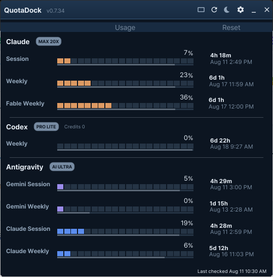
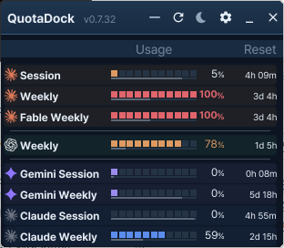
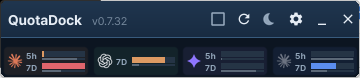

# QuotaDock

[English](./README.md) | [한국어](./README.ko-KR.md) | [简体中文](./README.zh-CN.md) | [繁體中文（臺灣）](./README.zh-TW.md) | [日本語](./README.ja-JP.md)

QuotaDock は、**Claude・OpenAI Codex・Google Antigravity** の利用上限 —— セッション/週間クォータと
リセットまでの残り時間 —— をひと目で確認できる、常に最前面に表示される小さな Windows デスクトップ
ウィジェットです。

[](https://github.com/jungdosa/QuotaDock/releases)
[](LICENSE)
[](https://go.dev/)
[](https://fyne.io/)
[](#対応プラットフォーム)

<p align="center">
  
</p>

Claude Code、Codex CLI、Antigravity IDE を使っていると、いつも同じことが気になります。
*5 時間セッションはあとどれくらい？ 週間上限はいつリセットされる？* QuotaDock が代わりに
見張ります。

| プロバイダー | 表示内容 | 接続方法 |
|---|---|---|
| **Claude**（Claude Code） | 5 時間セッション · 7 日間の週間 · Fable 週間 | 公式 Claude CLI の認証情報を再利用 |
| **OpenAI Codex** | セッション · 週間上限 | 公式 Codex CLI app-server（stdio JSONL） |
| **Google Antigravity** | Gemini および Claude/GPT グループのセッション · 週間 | ローカル言語サーバー（loopback） |

いずれかのプロバイダーが失敗しても、残りはそのまま動作します。各行は **分割バー（使用率）** の
下に **細い連続バー（リセットまでの残り時間）** を並べて描画するので、クォータが時間より速く
減っているかどうかがひと目で分かります。警告・危険のしきい値を超えると、バーと数値が警告色に
切り替わります。

## 画面

3 つのウィジェットビューと設定画面があります。ツールバーのボタンで `通常 → コンパクト → ナノ`
を巡回し、ナノはクリック 1 回でコンパクトに戻ります。

### 通常 —— すべてを一度に

プロバイダーごとのグループ、プランバッジ、使用量バーとリセットバー、カウントダウンとリセット時刻。

<p align="center"></p>

### コンパクト —— 1 行に 1 項目

パーセンテージの隣にリセットまでの残り時間を並べた、幅の狭いビューです。時間にマウスを重ねると
正確なリセット時刻のツールチップが表示されます。

<p align="center"></p>

### ナノ —— 極小ストリップ

プロバイダーごとに 1 マス、高さ約 78px。モニターの隅に置いておく用途です。行にマウスを重ねると
`プロバイダー · ウィンドウ / 残り時間 / リセット時刻` の 3 行ツールチップが表示されます。

<p align="center"></p>

## 機能

- **ライト · ダーク · システムテーマ**、12/24 時間の日付形式、プロバイダー別のカラーパレット、
  警告しきい値の設定
- **12 言語対応** —— 英語、韓国語、ドイツ語、フランス語、イタリア語、インドネシア語、
  ポルトガル語（ブラジル）、スペイン語（スペイン/ラテンアメリカ）、日本語、中国語（簡体字）、
  中国語（繁体字・台湾）。`システム` を選ぶと
  Windows の表示言語に従います
- **接続方式ボタン** —— プロバイダーごとに、どの方式（`CLI`・`Auth`・`IDE`）で接続しているかと
  その状態を表示します。CLI が未インストールならボタンを押すとカード内にインストール手順が
  展開されます
- **アップデート機能** —— 起動時に 1 回、および任意のタイミングで GitHub Releases を確認します。
  ダウンロードしたファイルはリリースアセットの SHA-256 と **2 回** 照合します —— ダウンロード
  直後と、インストーラー実行の直前。定期的なポーリングはなく、認証情報も送信しません
- **タスクバーに固定（Windows 11）** —— トレイアイコンがオーバーフロー領域に隠れないようにします

## インストール

[**Releases**](https://github.com/jungdosa/QuotaDock/releases) から入手できます。

| ファイル | 用途 |
|---|---|
| `QuotaDock-<バージョン>-win-x64-Setup.exe` | インストーラー版 —— スタートメニュー登録、スタートアップ実行は任意 |
| `QuotaDock-<バージョン>-win-x64-portable.exe` | インストール不要の単一実行ファイル |

バイナリはコード署名されていないため、SmartScreen の警告が出る場合があります。`SHA256SUMS.txt`
で整合性を確認してください。設定は不要です —— QuotaDock がログイン済みの公式 CLI / IDE を自動的に
検出して接続します。

> 現在のバージョンは `0.7.15` です。Windows の機能検証を終えた時点で `1.0.0` になります。

## 初回起動

セットアップウィザードもログイン画面も、どこかに貼り付ける作業もありません。

1. **QuotaDock** を起動します。常に最前面に表示される小さなウィジェットが現れます。
2. すでにお使いの公式ツールを自動的に探して接続します —— Claude Code CLI、Codex CLI、
   Antigravity IDE。
3. サインイン済みのプロバイダーは数秒で使用量の表示を開始します。

CLI が見つからないと表示された行があれば、**設定 → 接続** でそのプロバイダーの `CLI` ボタンを
押してください。カード内にインストール手順が展開されます —— 実行するコマンド、サインイン方法、
QuotaDock が探索する場所。導入後に `再スキャン` を押せば反映され、再起動は不要です。

普段の操作：

- ツールバーのボタンで `通常 → コンパクト → ナノ` を巡回し、ナノはクリック 1 回でコンパクトに
  戻ります。
- `✕` は終了ではなくトレイへの格納です。終了はトレイメニューから行います。
- タイトルバーをドラッグして移動できます。位置は次回起動時にも保持されます。

## プライバシー

QuotaDock は **そもそも認証情報を見ない** ように作られています。

- **尋ねずに読みます。** Claude の使用量は Claude Code がすでにこの PC に保存したトークンから
  取得します。Codex の使用量は公式 Codex CLI の app-server と stdio でやり取りします。
  Antigravity の使用量は `127.0.0.1` の言語サーバーから読みます。セッションキーを貼り付ける欄も、
  ブラウザー Cookie の抽出も、ブラウザー自動化もありません。
- **認証情報は画面に届きません。** トークン・Cookie・認証ファイルの原文を UI に描画しません。
  画面に渡るのは正規化された使用率、許可リストで検証したプランラベル、リセット時刻だけです。
- **診断記録はローカルだけに残ります。** 通常時は小さく上限を設けた JSON 診断ログを
  `%LOCALAPPDATA%\QuotaDock\quotadock.log` に記録します。異常終了時は同じフォルダーに
  `crash.log` が残ることがあります。秘密情報とメールアドレスは記録前に伏せられ、
  どちらのログも外部には送信されません。
- **外部通信は短い許可リストだけです。** プロバイダーへの要求は `api.anthropic.com` と
  `platform.claude.com` にのみ到達できます。アップデート確認は `api.github.com` と GitHub の
  配布ホストのみで、認証情報を含みません。それ以外はすべてループバックです。テレメトリも
  解析も、クラッシュレポートもありません。
- **設定はあなたのものです。** 設定は `%APPDATA%\QuotaDock\settings.json` にあり、アンインストール
  後も残ります。どこにも同期されません。
- **課金される要求を送りません。** 使用量の更新でクォータやクレジットを消費することはありません。

## 設計方針

- **尋ねません。** 公式ツールがインストール済みでログインしていれば、自動的に接続します。初回起動の
  ログインウィザードも、強制的なポップアップもありません。
- **秘密情報を扱いません。** トークン、Cookie、`auth.json` の原文が UI やログに渡ることはありません。
  UI に渡すのは正規化された使用率、許可リストで検証したプランラベル、リセット時刻だけです。
- **ローカルにのみ接続します。** テレメトリも外部分析サーバーもありません。loopback 接続は検証済みの
  プロセスと固定エンドポイントにのみ許可します。唯一の外向き通信はアップデート確認で、認証情報は
  含まれず、起動時とクリック時にしか発生しません。
- **クレジットを消費しません。** 使用量の更新のために課金対象の AI リクエストを送ることはありません。
- **軽量です。** Go + Fyne のネイティブ描画で、アイドル時 CPU 0%、メモリも積極的に管理します。

## 対応プラットフォーム

| 優先度 | プラットフォーム | 状態 |
|---|---|---|
| 第 1 | Windows 10 22H2+ / 11, x64 | **動作**（0.7.x） |
| 第 2 | macOS 14+, Apple Silicon | 予定 |

## ソースからのビルド

Fyne は CGO を使うため、Go だけではビルドできません。

- Go 1.26 以上
- C コンパイラ（Windows: MinGW-w64 / macOS: Xcode Command Line Tools）

```sh
git clone https://github.com/jungdosa/QuotaDock.git
cd QuotaDock
go build ./cmd/quotadock
```

リリース成果物（Setup.exe、portable、SHA256SUMS）は `build/windows/build-release.ps1` で生成します。

## ライセンス

MIT —— [LICENSE](LICENSE) を参照してください。

QuotaDock のソース、文言、画面デザイン、アプリアイコンはすべてオリジナルです。残作業は
[docs/REMAINING-WORK.md](docs/REMAINING-WORK.md) に記録しています。

### サードパーティ資産

| 資産 | 出典 | ライセンス |
|---|---|---|
| `assets/fonts/Pretendard-*.ttf` | [Pretendard](https://github.com/orioncactus/pretendard) | SIL OFL 1.1 —— [`Pretendard-OFL.txt`](assets/fonts/Pretendard-OFL.txt) |
| `assets/providers/*.svg` | [lobe-icons](https://github.com/lobehub/lobe-icons) | MIT —— [`LICENSE-lobe-icons.txt`](assets/providers/LICENSE-lobe-icons.txt) |

プロバイダーのロゴは各社（Anthropic、OpenAI、Google）の商標であり、QuotaDock が使用量を表示する
サービスを識別する目的でのみ使用しています。

---

<sub>keywords: Claude 使用量モニター · Claude Code レート制限 · OpenAI Codex クォータ · Gemini
Antigravity 使用量 · AI クォータ管理 · デスクトップウィジェット · システムトレイ · Windows · Go · Fyne</sub>
