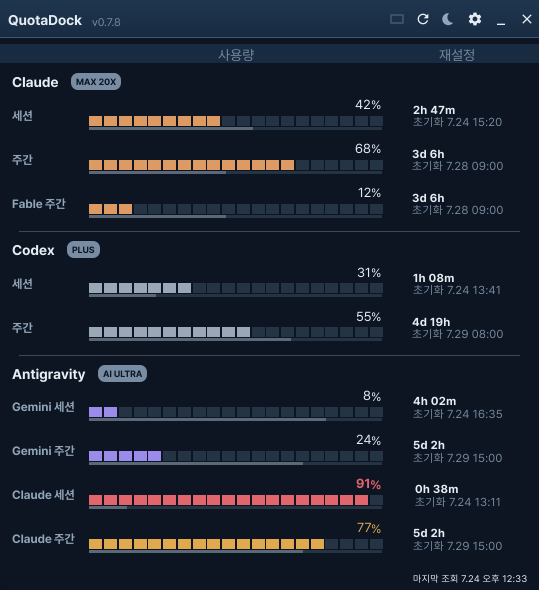
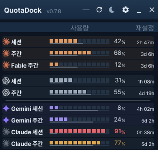
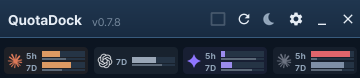
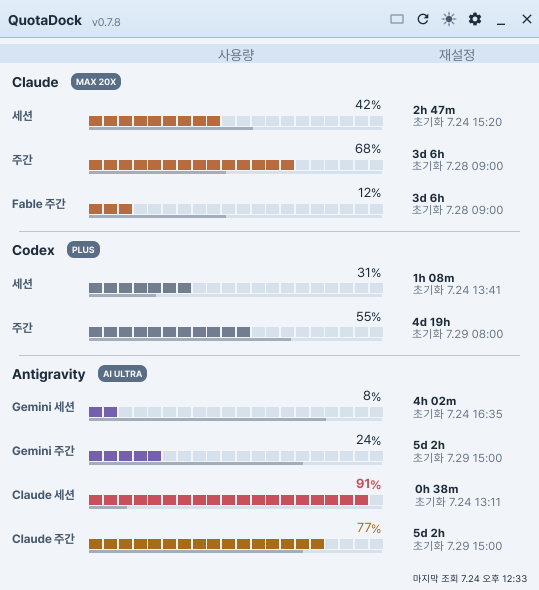

<div align="center">

# QuotaDock

**Claude · OpenAI Codex · Google Antigravity 사용량 한도를 한 화면에서 지켜보는 Windows 데스크톱 위젯**

*A tiny always-on-top Windows desktop widget that monitors your Claude, OpenAI Codex, and
Google Antigravity (Gemini) usage limits, session/weekly quotas, and reset timers — in one glance.*

[](https://github.com/jungdosa/QuotaDock/releases)
[](LICENSE)
[](https://go.dev/)
[](https://fyne.io/)
[](#지원-대상)



</div>

---

Claude Code, Codex CLI, Antigravity IDE를 쓰다 보면 "5시간 세션이 얼마나 남았지?",
"주간 한도는 언제 풀리지?"를 계속 확인하게 됩니다. QuotaDock은 세 공급자의 **세션·주간
사용률과 리셋까지 남은 시간**을 항상 떠 있는 작은 위젯으로 보여줍니다.

| 공급자 | 표시 항목 | 연결 방식 |
|---|---|---|
| **Claude** (Claude Code) | 5시간 세션 · 7일 주간 · Fable 주간 | 공식 Claude CLI 인증 재사용 |
| **OpenAI Codex** | 세션 · 주간 한도 | 공식 Codex CLI app-server (stdio JSONL) |
| **Google Antigravity** | Gemini · Claude/GPT 그룹의 세션 · 주간 | 로컬 언어 서버 (loopback) |

한 공급자가 실패해도 나머지는 계속 동작합니다. 각 행은 **분절 막대(사용률)** 와 그 아래의
**가는 연속 막대(리셋까지 남은 시간)** 를 함께 그려, 할당량이 시간 대비 얼마나 빨리
소진되는지 한눈에 읽힙니다. 경고·위험 임계값을 넘으면 막대와 수치가 경고색으로 바뀝니다.

## 화면

세 가지 위젯 화면과 설정 화면을 제공합니다. 툴바 버튼으로 `일반 → 컴팩트 → 나노`를
순환하고, 나노는 클릭 한 번으로 컴팩트로 돌아옵니다.

### 일반 — 전체 정보

공급자별 그룹, 요금제 뱃지, 사용량 막대 + 리셋 시간 막대, 재설정 카운트다운과 시각까지
모두 보여주는 기본 화면입니다.

<p align="center"></p>

### 컴팩트 — 한 줄 요약

행당 한 줄로 줄인 좁은 화면입니다. 사용률 옆에 리셋 잔여 시간이 붙고, 시간에 마우스를
올리면 정확한 리셋 시각 툴팁이 나타납니다.

<p align="center"></p>

### 나노 — 초소형 스트립

공급자당 한 칸, 높이 약 78px의 스트립입니다. 모니터 구석에 붙여두는 용도로, 행에
마우스를 올리면 `공급자 · 창 / 잔여 시간 / 리셋 시각` 3줄 툴팁이 나타납니다.

<p align="center"></p>

라이트 · 다크 · 시스템 테마, 한국어 · 영어 UI, 12/24시간 날짜 형식, 공급자별 색상
팔레트와 경고 임계값 설정을 지원합니다.

<p align="center"></p>

## 설치

[**Releases**](https://github.com/jungdosa/QuotaDock/releases)에서 받습니다.

| 파일 | 용도 |
|---|---|
| `QuotaDock-<버전>-win-x64-Setup.exe` | 설치본 — 시작 메뉴 등록, 선택적 Windows 시작 시 자동 실행 |
| `QuotaDock-<버전>-win-x64-portable.exe` | 무설치 단일 실행 파일 |

바이너리는 코드 서명이 없어 SmartScreen 경고가 나올 수 있습니다. `SHA256SUMS.txt`로
무결성을 확인하세요. 별도 설정 없이, 이미 로그인된 공식 CLI/IDE를 자동 탐색해 연결합니다.

> 현재 버전은 `0.7.8`입니다. Windows 기능 검증을 마치는 시점에 `1.0.0`이 됩니다.

## 설계 원칙

- **묻지 않습니다.** 공식 도구를 이미 설치하고 로그인했다면 자동으로 연결합니다. 최초 실행 로그인 마법사나 강제 팝업이 없습니다.
- **비밀정보를 다루지 않습니다.** 토큰, 쿠키, `auth.json` 원문을 읽어 UI로 전달하거나 로그에 남기지 않습니다. UI에는 정규화된 사용률, 허용 목록으로 검증된 요금제 라벨, 초기화 시각만 전달됩니다.
- **로컬에만 연결합니다.** 텔레메트리와 외부 분석 서버가 없습니다. loopback 연결은 검증된 프로세스와 고정된 endpoint에만 허용합니다.
- **크레딧을 쓰지 않습니다.** 사용량을 갱신하려고 불필요한 AI 요청을 보내지 않습니다.
- **가볍습니다.** Go + Fyne 네이티브 렌더링으로 유휴 CPU 0%, 메모리 사용을 적극 관리합니다.

## 지원 대상

| 순서 | 플랫폼 | 상태 |
|---|---|---|
| 1차 | Windows 10 22H2+ / 11, x64 | **동작** (0.7.x) |
| 2차 | macOS 14+, Apple Silicon | 예정 |
| 3차 | Linux x64 → arm64 | 예정 |

## 소스 빌드

Fyne은 CGO를 사용하므로 Go만으로는 빌드되지 않습니다.

- Go 1.24 이상
- C 컴파일러 (Windows: MinGW-w64 / macOS: Xcode Command Line Tools / Linux: gcc + X11 개발 헤더)

```sh
git clone https://github.com/jungdosa/QuotaDock.git
cd QuotaDock
go build ./cmd/quotadock
```

릴리스 산출물(Setup.exe, portable, SHA256SUMS)은 `build/windows/build-release.ps1`로 만듭니다.

## 저장소 범위

이 저장소에는 **Go 소스만** 둡니다. 남은 작업 계획은 [docs/REMAINING-WORK.md](docs/REMAINING-WORK.md)에 있습니다.

## 라이선스

MIT — [LICENSE](LICENSE) 참조.

QuotaDock의 소스, 문구, 화면 설계는 새로 작성한 것입니다. 개발 경위와 선행 프로젝트와의 관계는 [docs/PROVENANCE.md](docs/PROVENANCE.md)에 기록해 두었습니다.

---

<sub>keywords: Claude usage monitor · Claude Code rate limit · OpenAI Codex quota · Gemini
Antigravity usage · AI quota tracker · desktop widget · system tray · Windows · Go · Fyne ·
사용량 모니터 · 한도 위젯</sub>
